# Procesverslag
Markdown is een simpele manier om HTML te schrijven.  
Markdown cheat cheet: [Hulp bij het schrijven van Markdown](https://github.com/adam-p/markdown-here/wiki/Markdown-Cheatsheet).

Nb. De standaardstructuur en de spartaanse opmaak van de README.md zijn helemaal prima. Het gaat om de inhoud van je procesverslag. Besteedt de tijd voor pracht en praal aan je website.

Nb. Door *open* toe te voegen aan een *details* element kun je deze standaard open zetten. Fijn om dat steeds voor de relevante stuk(ken) te doen.

## Jij

  
uitwerken voor kick-off werkgroep

  ### Auteur:
  Ruben van der Peet (203 J2 25-26)

  #### Je startniveau:
  Rood, Zwart

  #### Je focus:
  1c, Responsive
 

## Je website

  
uitwerken voor kick-off werkgroep

  ### Je opdracht:
  Porsche
  https://www.porsche.com/international/

  Ik zou graag de website van Porsche's officiele internationale site willen namaken. Ik doe de landing page en 911 ontdekpagina.

  #### Screenshot(s) van de eerste pagina (small screen + big screen): 
  Landing page  
  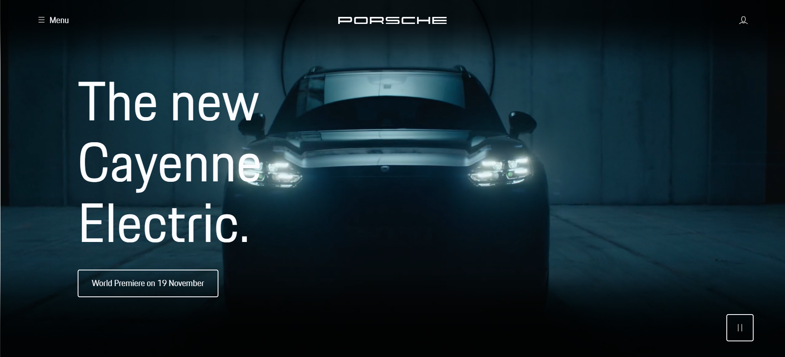
  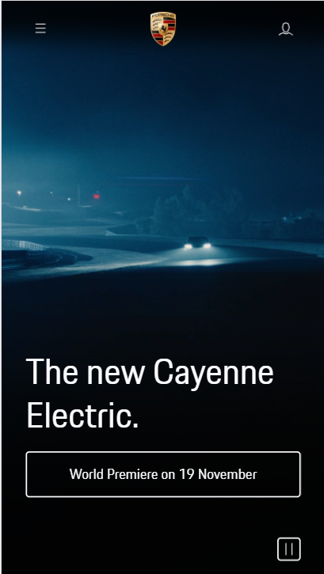

  #### Screenshot(s) van de tweede pagina (small screen + big screen ):
  911 Model verkennen
  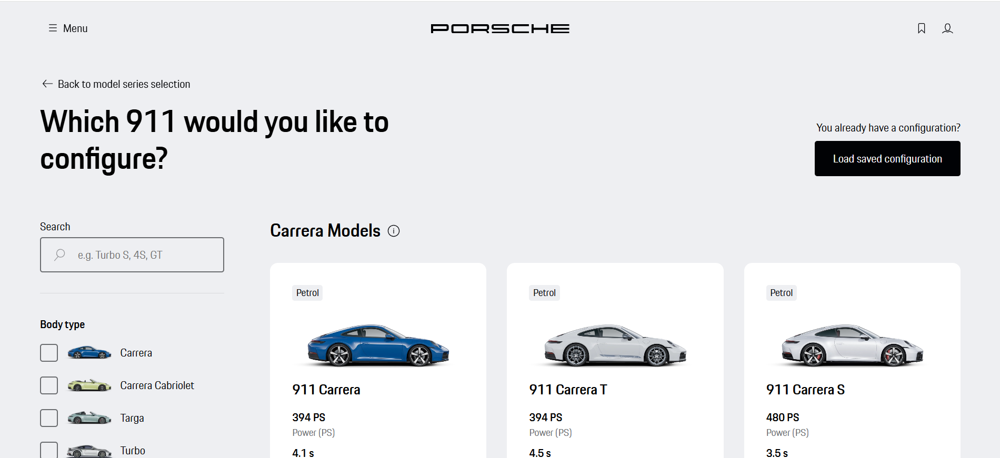
  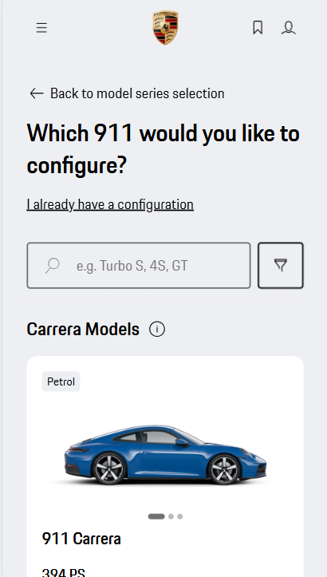

  #### design system van Porsche en de bijbehorende GitHub: met ondersteuning van deze site maak ik veel van mijn code:

  https://designsystem.porsche.com/v3/

  https://github.com/porsche-design-system/porsche-design-system
 

## Toegankelijkheidstest 1/2 (week 1)

  
uitwerken na test in 2e werkgroep

  ### Bevindingen

  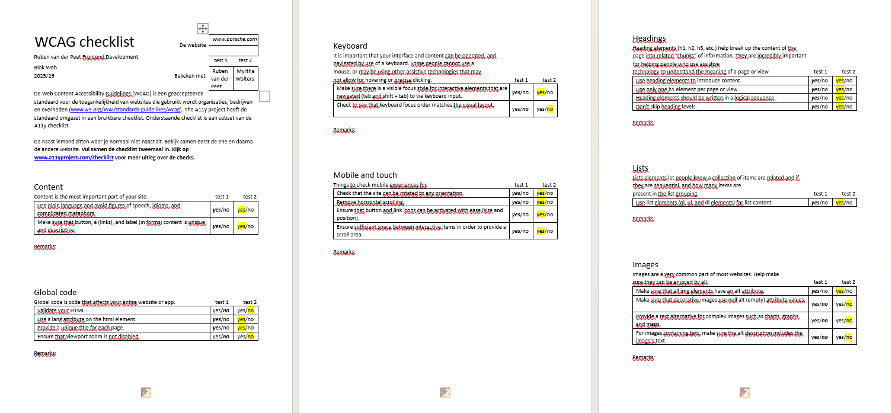
  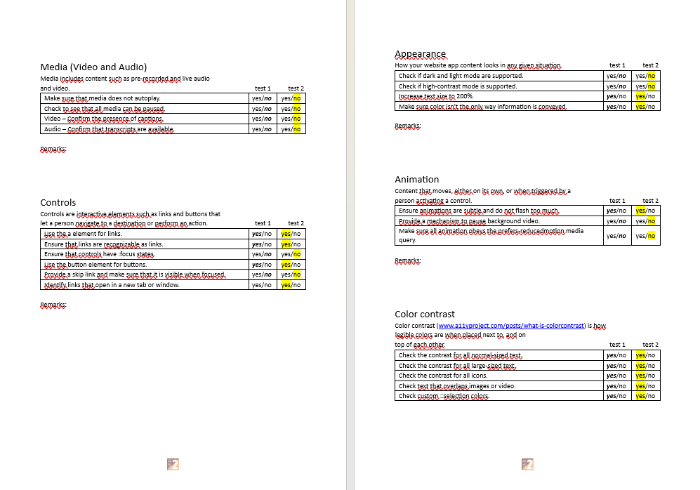

  Lijst met je bevindingen die in de test naar voren kwamen:

  1. De website is redelijk toegankelijk, en responsive, er zijn niet veel dingen aan de pagina die ik zelf hoef te veranderen.
  2. Sommige dingen van de test waren niet van toepassing voor mijn pagina: De media wordt meer als achtergrondinfo gebruikt.
  3. De HTML is grotendeels valide, met een paar kleine punten, de website zelf is al redelijk goed in elkaar gezet vanuit een FED standpunt.
  4. Een aantal hierarchische dingen aan de headings kloppen niet, dit kan ik zelf aanpassen
  5. Ik zal zelf een aantal verborgen H2's toevoegen.
  6. De pagina verandert steeds, houd daar rekening mee met het maken.

## Breakdownschets (week 1)

  
uitwerken na afloop 3e werkgroep

  ### landing page: 
  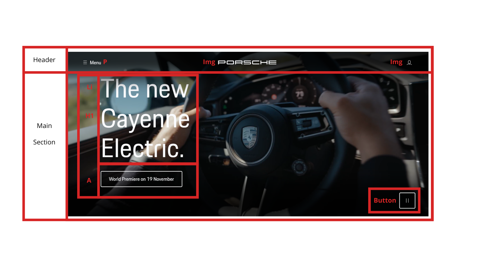

  ### discovery page (drie modellen):
  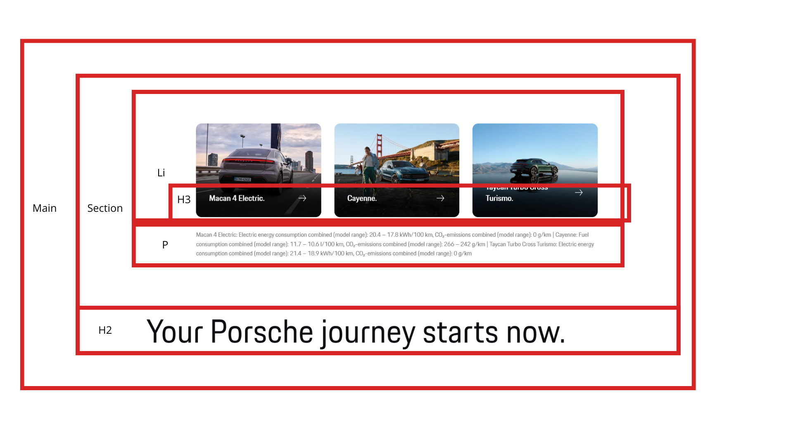

  ### alle modellen:
  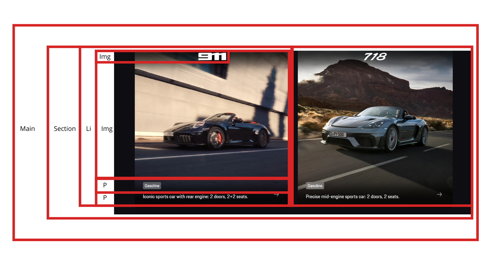

  ### porsche experiences:
  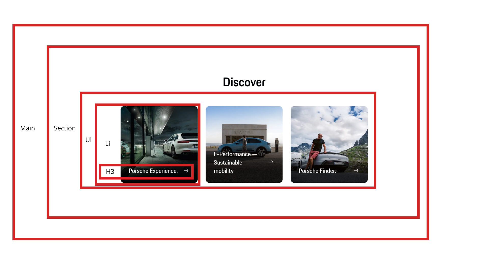

  ### bovenste deel van de footer:
  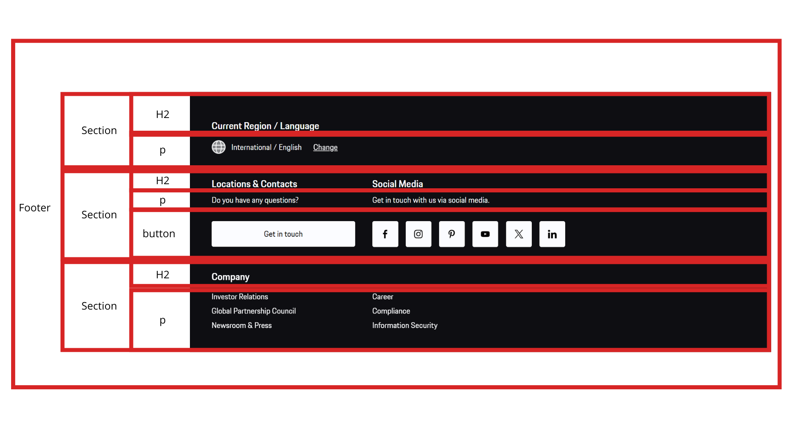

  ### onderste deel van de footer:
  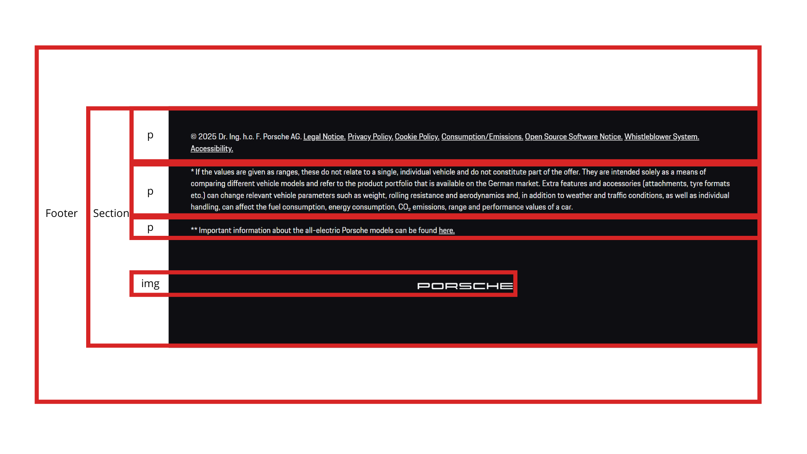

  ### Pagina 2: 911 model selectiescherm
  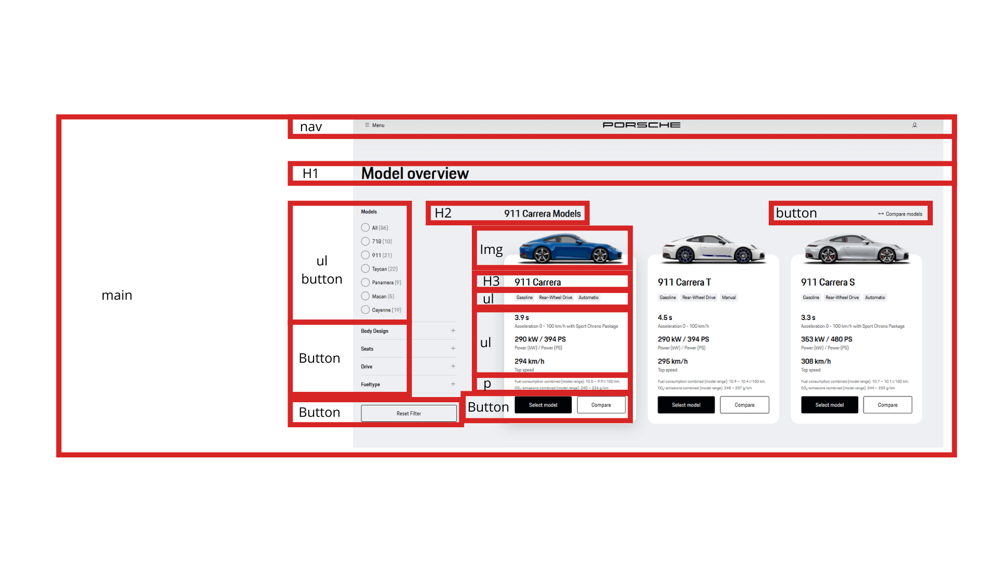

## Voortgang 1 (week 2)

  
uitwerken voor 1e voortgang

  ### Stand van zaken
  Voor de basis van de site had ik nog niet super veel vragen. Ik had een basis van mijn HTML pagina gemaakt. Wat ik wilde weten is hoe de structuur van Heading het best aangepakt zou worden

  ### Agenda voor meeting
  samen met je groepje opstellen

  | student 1      | student 2          | student 3    | student 4        |
  | ---            | ---                | ---          | ---              |
  | dit bespreken  | en dit             | en ik dit    | en dan ik dat    |
  | en dat ook nog | dit als er tijd is | nog een punt | dit wil ik zeker |
  | ...            | ...                | ...          | ...              |

  ### Verslag van meeting
  hier na afloop snel de uitkomsten van de meeting vastleggen

  - De H1 van mijn pagina is hidden, en kan vervangen worden met de foto midden bovenin de nav. Wat ik als H1 in de breakdownschets had kan als H2
  - De naam van mijn tweede HTML bestand moet anders als "index2.html"
  - Javascript zou ik kunnen verwerken in het Hamburgermenu

## Voortgang 2 (week 3)

  
uitwerken voor 2e voortgang

  ### Stand van zaken
  In week 3 ben ik vooral doorgegaan met alles op orde krijgen van de hoofdcontent op de twee pagina's. Ik heb de basis van de CSS aangelegd en alle HTML is zo goed als af, ik heb nog wel wat vragen over de structuur en het overnemen van bestanden zoals svg.

  ### Agenda voor meeting
  samen met je groepje opstellen

  | student 1      | student 2          | student 3    | student 4        |
  | ---            | ---                | ---          | ---              |
  | dit bespreken  | en dit             | en ik dit    | en dan ik dat    |
  | en dat ook nog | dit als er tijd is | nog een punt | dit wil ik zeker |
  | ...            | ...                | ...          | ...              |

  ### Verslag van meeting
  hier na afloop snel de uitkomsten van de meeting vastleggen

  - consequent in HTML hoofdletters in tags houden (h3 ipv H3)
  - SVG overnemen via (edit as HTML)
  - Fonts allemaal apart, maar zelfde naam met verschillende attributen
  - Tip van Myrthe (eigenlijk Ella) je kan in je html "attribuut + hidden" toevoegen, dat hoort semantisch correct te zijn

## Toegankelijkheidstest 2/2 (week 4)

  
uitwerken na test in 9e werkgroep

  ### Bevindingen
  Lijst met je bevindingen die in de test naar voren kwamen (geef ook aan wat er verbeterd is):

## Voortgang 3 (week 4)

  
uitwerken voor 3e voortgang

  ### Stand van zaken
  hier dit ging goed & dit was lastig (neem ook screenshots op van delen van je website en code)

  ### Agenda voor meeting
  samen met je groepje opstellen

  | student 1      | student 2          | student 3    | student 4        |
  | ---            | ---                | ---          | ---              |
  | dit bespreken  | en dit             | en ik dit    | en dan ik dat    |
  | en dat ook nog | dit als er tijd is | nog een punt | dit wil ik zeker |
  | ...            | ...                | ...          | ...              |

  ### Verslag van meeting
  hier na afloop snel de uitkomsten van de meeting vastleggen

  - Voor images stretchen fixen verwezen naar object-fit
  - voor de nav centeren even inactief zetten
  - nog een punt
  - ...

## Eindgesprek (week 5)

  
uitwerken voor eindgesprek

  ### Je uitkomst - karakteristiek screenshots:
  

  ### Dit ging goed/Heb ik geleerd: 
  Korte omschrijving met plaatjes

  

  ### Dit was lastig/Is niet gelukt:
  Korte omschrijving met plaatjes

  

## Bronnenlijst

  
continu bijhouden terwijl je werkt

  Nb. Wees specifiek ('css-tricks' als bron is bijv. niet specifiek genoeg). 
  Nb. ChatGpT en andere AI horen er ook bij.
  Nb. Vermeld de bronnen ook in je code.

  1. bron 1
  2. bron 2
  3. ...

